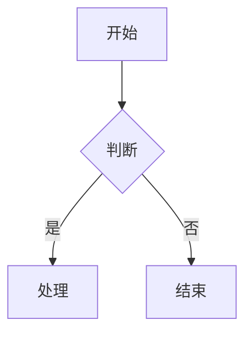

# 博客文章格式规范

本文件总结了 kblog (VuePress 2 + vuepress-theme-hope) 项目的文章格式标准、常见问题和最佳实践。

## 一、YAML Frontmatter（必须有）

每篇文章开头必须包含 `---` 包裹的 YAML frontmatter。

### 必须字段

| 字段 | 类型 | 说明 | 示例 |
|------|------|------|------|
| `title` | `string` | 文章标题 | `"CORS（跨域资源共享）"` |
| `date` | `string` | 发布日期，格式 `YYYY-MM-DD` | `"2025-06-26"` |

### 推荐字段

| 字段 | 类型 | 说明 | 示例 |
|------|------|------|------|
| `category` | `string` 或 `string[]` | 文章分类（建议用数组，保持一致性） | `["前端"]` 或 `"C++"` |
| `tags` | `string[]` | 文章标签（注意统一用 `tags` 不是 `tag`） | `["python", "asyncio"]` |
| `summary` | `string` | 文章摘要，显示在博客列表 | `"介绍 CORS 的工作原理..."` |

### 系列文章附加字段

| 字段 | 类型 | 说明 |
|------|------|------|
| `prev` | `string` | 上一篇文章的相对路径 |
| `next` | `string` | 下一篇文章的相对路径 |

### Frontmatter 示例

```yaml
---
title: CORS（跨域资源共享）
date: 2025-06-26
category: ["前端"]
tags: ["CORS", "HTTP", "跨域", "安全"]
summary: 介绍浏览器的同源策略和 CORS 跨域资源共享机制。
---
```

**注意：** 旧文章中使用了 `tag`（单数）字段名，新文章统一用 `tags`（复数）。

---

## 二、标题层级

严格的层级关系：`#` (h1) → `##` (h2) → `###` (h3)。不允许跳级。

### 正确示例

```markdown
# 文章主标题

## 章节一

### 小节 1.1

### 小节 1.2

## 章节二

### 小节 2.1
```

### 常见错误

| 错误 | 说明 |
|------|------|
| 从 `#` 直接跳到 `###` | 跳过 h2，层级断裂 |
| 只用 `##` 没有 `#` | 缺少文章主标题 |
| 完全没有标题 | 随笔可用，技术文章必须有 |
| 标题用纯文本不加 `#` | Markdown 不会识别为标题 |
| 出现两个 `#`（h1） | 一篇文章只能有一个 h1 |
| 使用下划线式标题 (`=====`) | 不兼容 VuePress |

---

## 三、代码块

### 规范

- 必须使用围栏代码块（`` ```lang ``），不能用缩进式代码块
- 必须标注正确的语言标签
- 禁止使用 HTML `<pre><table>` 标签包裹代码

### 常用语言标签

| 代码类型 | 正确标签 | 错误标签（已发现） |
|----------|----------|-------------------|
| Python | `python` 或 `py` | `mipsasm`、`java`、`gauss` |
| TypeScript | `ts` 或 `typescript` | - |
| JavaScript | `js` 或 `javascript` | - |
| C++ | `cpp` 或 `c++` | - |
| Shell | `sh` 或 `bash` | `crmsh`、`avrasm` |
| JSON | `json` | - |
| YAML | `yaml` 或 `yml` | - |
| 纯文本输出 | `text`（或省略标签） | - |
| Mermaid | `mermaid` | - |

### 示例

```markdown
```python
def hello():
    print("Hello, World!")
```

```sh
$ npm install vuepress
```

```text
程序输出：
Hello, World!
```
```

---

## 四、文章内容结构

### 推荐结构

```
Frontmatter
  ↓
<!-- more -->（控制摘要截断）
  ↓
# 文章标题（h1）
  ↓
简短引言（1-2 段说明背景和目的）
  ↓
## 章节（h2）
  ↓
正文 + 代码块 + 图表
  ↓
### 小节（h3，按需）
  ↓
## 总结 / 参考资料（h2）
  ↓
---（分隔线）+ 参考资料列表
```

### 内容规范

- 每个代码块前后应有文字说明
- 图片使用有意义的 alt 文本和描述性文件名
- 图片路径使用完整的 CDN URL 或相对于 `docs/` 的路径
- 转载文章必须在开头注明出处
- 文章结尾可以加 `---` 分隔线

---

## 五、图片引用

### 规范

```markdown
<!-- 推荐：CDN URL + 描述性 alt 文本 -->


<!-- 如果用本地文件，用相对路径（相对于文章所在目录） -->

```

### 常见错误

| 错误 | 说明 |
|------|------|
| `` | 无意义的 alt 文本和文件名 |
| `` | 裸文件名，没有路径 |
| `` | 中文文件名可能导致渲染问题 |

---

## 六、VuePress 增强功能

该项目启用了以下 markdown 增强，可酌情使用：

### 容器

```markdown
::: tip 提示
这是一个提示信息。
:::

::: info 信息
这是信息。
:::

::: warning 警告
这是警告。
:::

::: important 重要
这是重要信息。
:::
```

### 数学公式（KaTeX）

```markdown
行内公式：$E = mc^2$

块级公式：
$$
\int_0^\infty e^{-x} dx = 1
$$
```

### Mermaid 图表

```markdown

```

### PlantUML

```markdown
@startuml
class Foo {
  +bar()
}
@enduml
```

---

## 七、格式检查清单

在撰写或修改文章后，逐项检查：

- [ ] frontmatter 包含 `title` 和 `date`
- [ ] frontmatter 包含 `category` 和 `tags`（复数）
- [ ] `#` (h1) 只有一个，且与 frontmatter `title` 一致
- [ ] 标题层级严格 `h1 → h2 → h3`，不跳级
- [ ] 所有代码块使用围栏语法（`` ``` ``），并标注正确的语言标签
- [ ] 代码块前后有文字说明
- [ ] 图片 alt 文本有描述性，文件名有意义
- [ ] 转载文章已注明出处
- [ ] 没有裸 HTML 代码块（`<pre><table>`）
- [ ] 没有重复内容
- [ ] 没有未完成的 TODO 占位符
- [ ] 正文不存在"标题用纯文本不加 `#`"的问题

---

## 八、文章质量参考对照

### 优秀范例

| 文章 | 路径 | 优点 |
|------|------|------|
| C++ lambda 重载模式 | `docs/tech/lambda.md` | frontmatter 完整、标题层级正确、代码标签准确、有参考资料 |
| CORS 跨域资源共享 | `docs/tech/cors.md` | frontmatter 完整、结构清晰、代码标签准确、内容专业 |
| Strategy 模式 | `docs/tech/DesignPatterns/strategy.md` | frontmatter 完整（含 prev/next）、层级正确、UML 图、代码标签准确 |

### 常见问题类型

| 问题 | 涉及文章示例 |
|------|------------|
| 缺少 frontmatter | `协程.md`, `hmm.md`, `raft.md`, `github 工作流.md`, `asyncio.md`, `二维平面划分.md`, `python循环依赖.md` |
| 缺少 `date` | `functools_wraps.md`, `栈式散列符号表.md`, `designASimpileCCompiler/` 系列 |
| `tag`（单数）应为 `tags` | `actor.md`, `lambda.md`, `cicd.md` 等多数旧文章 |
| 标题层级跳级 | `raft.md`（h1→h3），`数仓.md`（h1→h3） |
| 代码块语言标签错误 | `协程(asyncio)到底需不需要加锁.md`（python 被标为 mipsasm/java/gauss） |
| 代码用 HTML `<pre>` 标签 | `designASimpileCCompiler/` 系列所有文章 |
| 缺少 `#` 标题语法 | `functools_wraps.md`（标题写作纯文本） |
| 无标题结构 | `mailserver.md`, `福祸相依.md`, `命里有时终须有.md` |
| 重复内容 | `actor.md`（第二遍 h1 重复了第一遍的结构） |
| 不完整的草稿 | `二维平面划分.md`, `python循环依赖.md`, `cicd.md` |
