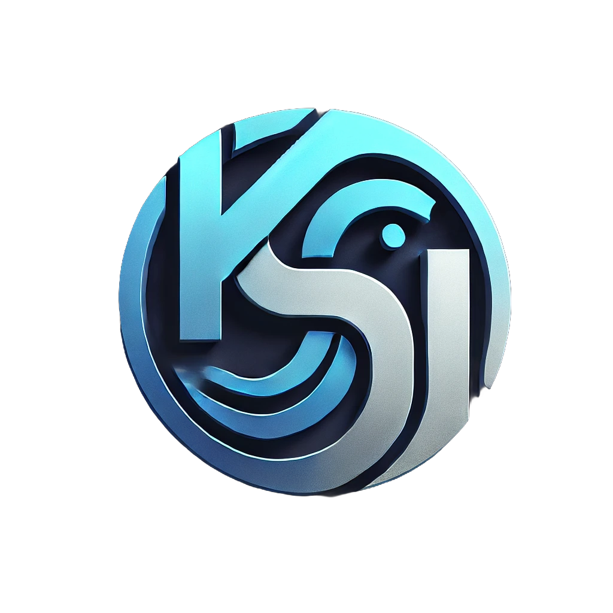

<!-- Improved compatibility of back to top link: See: https://github.com/King-sj/KBlog/pull/73 -->
<a id="readme-top"></a>
<!--
*** Thanks for checking out the Best-README-Template. If you have a suggestion
*** that would make this better, please fork the repo and create a pull request
*** or simply open an issue with the tag "enhancement".
*** Don't forget to give the project a star!
*** Thanks again! Now go create something AMAZING! :D
-->


<!-- PROJECT SHIELDS -->
<!--
*** I'm using markdown "reference style" links for readability.
*** Reference links are enclosed in brackets [ ] instead of parentheses ( ).
*** See the bottom of this document for the declaration of the reference variables
*** for contributors-url, forks-url, etc. This is an optional, concise syntax you may use.
*** https://www.markdownguide.org/basic-syntax/#reference-style-links
-->
[![Contributors][contributors-shield]][contributors-url]
[![Forks][forks-shield]][forks-url]
[![Stargazers][stars-shield]][stars-url]
[![Issues][issues-shield]][issues-url]
[![MIT License][license-shield]][license-url]
[![LinkedIn][linkedin-shield]][linkedin-url]


<!-- PROJECT LOGO -->
<br />
<div align="center">
  <a href="https://github.com/King-sj/KBlog">
    
  </a>

  <h3 align="center">KBlog</h3>

  <p align="center">
    A Blog for myself
    <br />
    <a href="https://github.com/King-sj/KBlog"><strong>Explore the docs »</strong></a>
    <br />
    <br />
    <a href="http://bupt.online">View Demo</a>
    ·
    <a href="https://github.com/King-sj/KBlog/issues/new?labels=bug&template=bug-report---.md">Report Bug</a>
    ·
    <a href="https://github.com/King-sj/KBlog/issues/new?labels=enhancement&template=feature-request---.md">Request Feature</a>
  </p>
</div>


<!-- TABLE OF CONTENTS -->
<details>
  <summary>Table of Contents</summary>
  <ol>
    <li>
      <a href="#about-the-project">About The Project</a>
      <ul>
        <li><a href="#built-with">Built With</a></li>
      </ul>
    </li>
    <li>
      <a href="#getting-started">Getting Started</a>
      <ul>
        <li><a href="#prerequisites">Prerequisites</a></li>
        <li><a href="#installation">Installation</a></li>
      </ul>
    </li>
    <li><a href="#usage">Usage</a></li>
    <li><a href="#roadmap">Roadmap</a></li>
    <li><a href="#contributing">Contributing</a></li>
    <li><a href="#license">License</a></li>
    <li><a href="#contact">Contact</a></li>
    <li><a href="#acknowledgments">Acknowledgments</a></li>
  </ol>
</details>


<!-- ABOUT THE PROJECT -->
## About The Project

[![Product Name Screen Shot][product-screenshot]](http://bupt.online)

Welcome to my personal blog, a digital space where I share insights, experiences, and knowledge across a variety of topics. This blog is more than just a collection of articles; it's a platform for dialogue, learning, and inspiration.

The primary goal of this blog is to bridge the gap between complex ideas and practical understanding. Here, I explore subjects ranging from technology and science to personal growth and culture. Each post is designed to provide value, whether it’s through detailed tutorials, thought-provoking essays, or in-depth analysis of current trends.

<p align="right">(<a href="#readme-top">back to top</a>)</p>


### Built With

* [![Vue][Vue.js]][Vue-url]
* [VuePress](vuepress-url)

<p align="right">(<a href="#readme-top">back to top</a>)</p>


<!-- GETTING STARTED -->
## Getting Started

### Prerequisites
* node.js
* npm

### Installation

1. Clone the repo
   ```sh
   git clone https://github.com/King-sj/KBlog.git
   ```
2. Install NPM packages
   ```sh
   npm install
   ```
3. run
   ```sh
   npm run docs:dev
   ```

<p align="right">(<a href="#readme-top">back to top</a>)</p>


<!-- USAGE EXAMPLES -->
## Usage

you could directly click the link
after you run the project, then you will see the blog on the browser

<p align="right">(<a href="#readme-top">back to top</a>)</p>


<!-- ROADMAP -->
## Roadmap

- [x] Add Changelog
- [x] Add back to top links
- [ ] Multi-language Support
    - [ ] Chinese
    - [x] English

See the [open issues](https://github.com/King-sj/KBlog/issues) for a full list of proposed features (and known issues).

<p align="right">(<a href="#readme-top">back to top</a>)</p>


<!-- CONTRIBUTING -->
## Contributing

Contributions are what make the open source community such an amazing place to learn, inspire, and create. Any contributions you make are **greatly appreciated**.

If you have a suggestion that would make this better, please fork the repo and create a pull request. You can also simply open an issue with the tag "enhancement".
Don't forget to give the project a star! Thanks again!

1. Fork the Project
2. Create your Feature Branch (`git checkout -b feature/AmazingFeature`)
3. Commit your Changes (`git commit -m 'Add some AmazingFeature'`)
4. Push to the Branch (`git push origin feature/AmazingFeature`)
5. Open a Pull Request

<p align="right">(<a href="#readme-top">back to top</a>)</p>


<!-- LICENSE -->
## License

Distributed under the MPL-2 License. See `LICENSE.txt` for more information.

<p align="right">(<a href="#readme-top">back to top</a>)</p>


<!-- CONTACT -->
## Contact

Song Jian - 2175616761@qq.com

Project Link: [https://github.com/King-sj/KBlog](https://github.com/King-sj/KBlog)

<p align="right">(<a href="#readme-top">back to top</a>)</p>


<!-- ACKNOWLEDGMENTS -->
## Acknowledgments
* [Choose an Open Source License](https://choosealicense.com)
* [GitHub Emoji Cheat Sheet](https://www.webpagefx.com/tools/emoji-cheat-sheet)
* [Font Awesome](https://fontawesome.com)
* [VuePress](https://vuepress.vuejs.org/)

<p align="right">(<a href="#readme-top">back to top</a>)</p>


<!-- MARKDOWN LINKS & IMAGES -->
<!-- https://www.markdownguide.org/basic-syntax/#reference-style-links -->
[contributors-shield]: https://img.shields.io/github/contributors/King-sj/KBlog.svg?style=for-the-badge
[contributors-url]: https://github.com/King-sj/KBlog/graphs/contributors
[forks-shield]: https://img.shields.io/github/forks/King-sj/KBlog.svg?style=for-the-badge
[forks-url]: https://github.com/King-sj/KBlog/network/members
[stars-shield]: https://img.shields.io/github/stars/King-sj/KBlog.svg?style=for-the-badge
[stars-url]: https://github.com/King-sj/KBlog/stargazers
[issues-shield]: https://img.shields.io/github/issues/King-sj/KBlog.svg?style=for-the-badge
[issues-url]: https://github.com/King-sj/KBlog/issues
[license-shield]: https://img.shields.io/github/license/King-sj/KBlog.svg?style=for-the-badge
[license-url]: https://github.com/King-sj/KBlog/blob/master/LICENSE.txt
[linkedin-shield]: https://img.shields.io/badge/-LinkedIn-black.svg?style=for-the-badge&logo=linkedin&colorB=555
[linkedin-url]: https://linkedin.com/in/othneildrew
[product-screenshot]: images/screenshot.png

[Vue.js]: https://img.shields.io/badge/Vue.js-35495E?style=for-the-badge&logo=vuedotjs&logoColor=4FC08D
[Vue-url]: https://vuejs.org/

[vuepress-url]: https://vuepress.vuejs.org/
