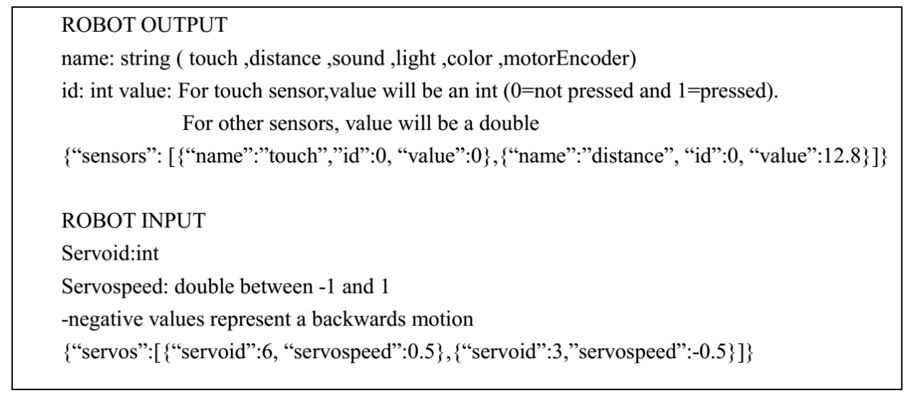

[项目源码](https://github.com/king-sj/carrobot)

~~因为想要创新学分，所以选了创新创业智能车课程~~，项目要求完成智能车的循迹和避障。

由于笔者不喜欢使用VPL的图形化（~~报用qWq~~）, 故而使用手写代码的方式实现。
<!-- more -->

## 主要思路
  通过接发TCP包的方法与智能车进行交互， 创建两个**并行**任务，一个用于实时接收TCP报文来更新小车状态， 一个用于读取小车状态，作出决策并发送报文控制小车。

## 编程语言的选择
- ```python``` 笔者的项目采用了该语言，主要原因是方便且能快速实现（~~以及没考虑到GIL会影响介么大~~），并采用asyncio作为“并行”库（实际上只能并发，笔者最初以为只有两个任务，用python也足够了，~~虽然实际上也够，但是写起来没那么舒服了~~，可能使用threads会好一点）
- ```go``` 后续又采用go重构了一遍（~~虽然实际效果貌似变化不大，emmm...应该是硬件/小车的原因~~）

当然采用什么编程语言并不是重要（吗？，不许用rust :angry: ）

## 通信协议


## 初步思路
  由于硬件限制，只有一个红外传感器用于判断底部是否为黑色， 一个红外传感器+超声波传感器用于确定前方是否有障碍，信息量非常小（~~当然超声波传感器有大概的距离，本项目不考虑介么多，取较小距离为有障碍~~）， 为 $(inRoad, haveObstacle) \in Z_2^2$。 故而首先考虑的基本策略是偏航时左右摆头寻找**正确**的角度前行。

## 遇到的问题和改进方案

### 小车左右轮力矩不一致
由于硬件限制，若设置两个轮的速度一致的话小车直行也会偏转， 而且小车并不能知道自己“偏航”了，故而采取手动测试的方式， 通过二分左右轮的速度来得到使得小车直行的左右轮速度。并且这个关系并非简单的倍速或差量的关系。

因此无奈之下只能选取一个固定的速度来测试（比如左轮设置为0.8, 然后不断二分得到直行时右轮的速度为 0.x ）, 整个系统都在该速度下运行。

:::tip
各个小车有各个的体质， 因此挑选一辆"正确"的小车是很重要的事情。 以及测试完小车后保护小车也是很重要的，不要找不到了或者被人踢坏了， 否则得重新找车及测速。
:::

### 小车容易冲出轨道

  小车还未找到合适的“姿势”就前进，导致频繁冲出赛道，耗费时间。

  基于此，采取速度渐进增长的形式，使得刚回到正确姿势时速度较慢，从而不会前进太多，便于更快的回到正确的姿势。

### 小车总是左右左摆头太蠢了
  首先采取的改进方案是先左小幅度转弯，后右大幅度转弯，最后左大幅度转弯寻找正确姿势，但效果不理想，遂放弃。

  考虑到小车路线是闭合的，且局部多为凸多边形， 故而每次转弯时优先考虑上一次转弯的方向， 这样子能减少摆头次数， 多数情况转弯的方向都是对的。（~~有一些启发式的smell~~）
### 其它问题
  ~~时间有点久搞忘了，记起来再补充~~
## 设计方案参考

@startuml
actor User
participant Main as "main()"
participant Logging as "setup_logging()"
participant Car as "Car"
participant Control as "control_car(car)"

User -> Main: __main__.py
activate Main
Main -> Logging: setup_logging()
activate Logging
Logging --> Main: logging configured
deactivate Logging

Main -> Car: Car()
activate Car
Main -> Car: connect()
activate Car
Car --> Main: connected
deactivate Car

Main -> Control: control_car(car)
activate Control
Control -> Car: update_state()
activate Car
Control -> Car: straight()
Control -> Car: adjustment_dir()
deactivate Control
deactivate Car

Main -> Main: asyncio.gather()
deactivate Main
@enduml

@startuml
class Car {
  +connect()
  +update_state()
  +set_speed(left_speed: float, right_speed: float)
  +distance: float
  +in_road: bool
  +have_obstacle: bool
}

class RobotCraftCar {
  +straight()
  +low_straight()
  +turn_left()
  +turn_right()
  +adjustment_dir(dir: Direction, duration: float, is_right_gesture: Callable)
}

Car <|-- RobotCraftCar

enum Direction {
  LEFT
  RIGHT
}

RobotCraftCar --> Direction
@enduml


## 和机械臂联动
  emm... 本来想让机械臂识别“货物”并放在车上托运并最后卸货的，但是小车不好运货。遂放弃，转而实验机械臂放置障碍在赛道上。


## 结语
  本次智能车实验不是很愉快， 特别是重调了3，4次速度（几次换车~~其中一次车被踩烂了~~）

  如果没有熟悉的编程语言（例如c）且不了解 多线程/协程，网络I/O的话 还是采用VPL图形化吧 ~~不过我认为报用就是了~~。

  记得给我的仓库点Star欧~
