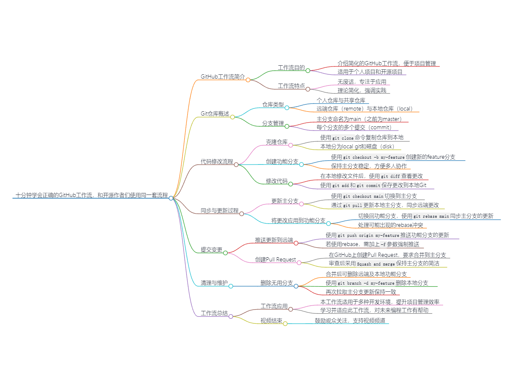
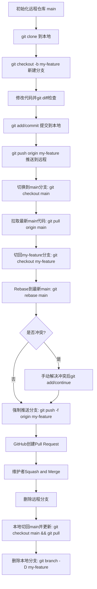

# github 工作流程

[十分钟学会正确的github工作流，和开源作者们使用同一套流程](https://www.bilibili.com/video/BV19e4y1q7JJ)

--------------------------------------------------------------------------------

## 流程图

## init

- Remote: [main]init
- Local: null
- Disk: null

  ## git clone

- Remote: [main]init
- Local: [main]init
- Disk: init

  ## git checkout -b my-feature

   新建功能分支
- Remote: [main]init
- Local: [main]init [my-feature]init
- Disk: init

  ## 修改代码

- Remote: [main]init
- Local: [main]init [my-feature]init
- Disk: changes 进行下一步之前最好用git diff查看改了什么

  ## git add , commit

- Remote: [main]init
- Local: [main]init [my-feature]init -> f-commit
- Disk: f-commit

  ## git push origin my-feature

- Remote: [main]init -> update(some-other-people) [my-feature]init -> f-commit
- Local: [main]init [my-feature]init -> f-commit
- Disk: f-commit

  ## git checkout main

- Remote: [main]init -> update [my-feature]init -> f-commit
- Local: [main]init [my-feature]init -> f-commit
- Disk: init

  ## git pull origin main

- Remote: [main]init -> update [my-feature]init -> f-commit
- Local: [main]init->update [my-feature]init -> f-commit
- Disk: update

  ## git checkout my-feature

- Remote: [main]init -> update [my-feature]init -> f-commit
- Local: [main]init->update [my-feature]init -> f-commit
- Disk: f-commit

  ## git rebase main

   可能出现rebase conflict, 需要手动解决
- Remote: [main]init -> update [my-feature]init -> f-commit
- Local: [main]init->update [my-feature]init -> update -> f-commit
- Disk: f-commit

  ## git push -f origin my-feature

- Remote: [main]init -> update [my-feature]init -> update -> f-commit
- Local: [main]init->update [my-feature]init -> update -> f-commit
- Disk: f-commit

  ## new pull request(in github)

- Remote: [main]init -> update [my-feature]init -> update -> f-commit
- Local: [main]init->update [my-feature]init -> update -> f-commit
- Disk: f-commit

  ## 维护者: squash and merge

   feature上众多改变合并为一个改变
- Remote: [main]init -> update -> update2 [my-feature]init -> update -> f-commit
- Local: [main]init->update [my-feature]init -> update -> f-commit
- Disk: f-commit

  ## delete branch my-feature

- Remote: [main]init -> update -> update2
- Local: [main]init->update [my-feature]init -> update -> f-commit
- Disk: f-commit

  ## git checkout main & git branch -D my-feature

- Remote: [main]init -> update -> update2
- Local: [main]init->update
- Disk: update

  ## git pull origin main

   完结
- Remote: [main]init -> update -> update2
- Local: [main]init -> update -> update2
- Disk: update2
