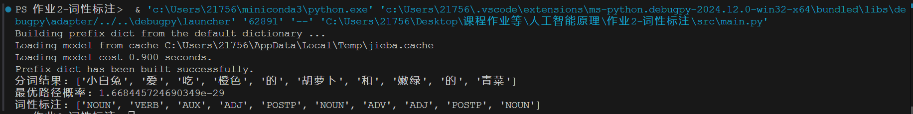

# HMM 词性标注
```py
import jieba
from collections import defaultdict, Counter

# 读取训练数据
lines = '''
清晨/NOUN 小白兔/NOUN 背着/VERB 一个/NUM 小篮子/NOUN ，/PUNCT 来到/VERB 集市/NOUN 上/POSTP 买/VERB 菜/NOUN 。
集市/NOUN 上/POSTP 人/NOUN 很多/ADJ ，/PUNCT 摊位/NOUN 上/POSTP 摆满/VERB 了/AUX 新鲜/ADJ 的/POSTP 蔬菜/NOUN 水果/NOUN 。
小白兔/NOUN 的/POSTP 鼻子/NOUN 嗅/VERB 了/AUX 嗅/VERB ，/PUNCT 空气/NOUN 里/POSTP 弥漫/VERB 着/AUX 各种/ADJ 蔬菜/NOUN 的/POSTP 清香/NOUN 。
它/PRON 蹦/VERB 到/POSTP 一个/NUM 摊位/NOUN 前/POSTP ，/PUNCT 眼睛/NOUN 一下子/ADV 被/AUX 一堆/NUM 橙色/ADJ 的/POSTP 胡萝卜/NOUN 吸引/VERB 住/AUX 了/AUX 。
“/PUNCT 真/ADV 漂亮/ADJ 的/POSTP 胡萝卜/NOUN ！”/PUNCT 小白兔/NOUN 心想/VERB ，/PUNCT 伸出/VERB 前爪/NOUN ，/PUNCT 挑起/VERB 一根/NUM 又/ADV 长/ADJ 又/ADV 直/ADJ 的/POSTP 胡萝卜/NOUN 翻看/VERB 起来/AUX 。
“/PUNCT 这/PRON 根/NOUN 看起来/VERB 很/ADV 甜/ADJ ！/PUNCT 咦/INTJ ，/PUNCT 那/PRON 根/NOUN 也/ADV 不错/ADJ ！”/PUNCT 它/PRON 挑挑拣拣/VERB ，/PUNCT 不一会儿/ADV 就/ADV 挑/VERB 了/AUX 五六根/NUM 大小/ADJ 均匀/ADJ 的/POSTP 胡萝卜/NOUN 放/VERB 进/POSTP 篮子/NOUN 里/POSTP 。
挑/VERB 完/AUX 胡萝卜/NOUN ，/PUNCT 小白兔/NOUN 又/ADV 走/VERB 到/POSTP 白菜/NOUN 摊/NOUN 前/POSTP ，/PUNCT 摸/VERB 了/AUX 摸/VERB 圆润/ADJ 的/POSTP 白菜/NOUN ，/PUNCT “/PUNCT 这个/PRON 可以/VERB 做/VERB 汤/NOUN ！”/PUNCT
接着/ADV ，/PUNCT 它/PRON 又/ADV 挑/VERB 了/AUX 些/NUM 嫩绿/ADJ 的/POSTP 青菜/NOUN ，/PUNCT “/PUNCT 这/PRON 青菜/NOUN 炒/VERB 起来/AUX 一定/ADV 很/ADV 好吃/ADJ ！”/PUNCT
买/VERB 完/AUX 菜/NOUN 后/POSTP ，/PUNCT 小白兔/NOUN 掏/VERB 出/POSTP 一个/NUM 小布袋/NOUN ，/PUNCT 从/POSTP 里面/NOUN 拿/VERB 出/POSTP 几枚/NUM 亮晶晶/ADJ 的/POSTP 硬币/NOUN ，/PUNCT 递/VERB 给/POSTP 摊主/NOUN ，/PUNCT “/PUNCT 谢谢/VERB 您/PRON ，/PUNCT 胡萝卜/NOUN 真/ADV 新鲜/ADJ ！”/PUNCT
摊主/NOUN 笑呵呵/ADV 地/POSTP 接/VERB 过/POSTP 硬币/NOUN ，/PUNCT 送/VERB 了/AUX 小白兔/NOUN 一颗/NUM 香菜/NOUN ，/PUNCT “/PUNCT 小白兔/NOUN ，/PUNCT 下次/ADV 再/ADV 来/VERB 啊/INTJ ！”/PUNCT
回家/VERB 的/POSTP 路上/NOUN ，/PUNCT 小白兔/NOUN 一边/ADV 哼/VERB 着/AUX 小曲儿/NOUN ，/PUNCT 一边/ADV 想象/VERB 着/AUX 美味/ADJ 的/POSTP 午餐/NOUN 。
'''

# 初始化概率字典
start_probability = defaultdict(float)
transition_probability = defaultdict(lambda: defaultdict(float))
emission_probability = defaultdict(lambda: defaultdict(float))

# 统计计数
start_counts = Counter()
transition_counts = defaultdict(Counter)
emission_counts = defaultdict(Counter)
state_counts = Counter()

# 处理训练数据
for line in lines.strip().split('\n'):
    words_tags = [wt.split('/') for wt in line.strip().split()]
    previous_tag = None
    for i, wt in enumerate(words_tags):
        if len(wt) != 2:
            continue
        word, tag = wt
        state_counts[tag] += 1
        emission_counts[tag][word] += 1
        if i == 0:
            start_counts[tag] += 1
        if previous_tag is not None:
            transition_counts[previous_tag][tag] += 1
        previous_tag = tag

# 计算概率
total_start = sum(start_counts.values())
for tag, count in start_counts.items():
    start_probability[tag] = count / total_start

for prev_tag, next_tags in transition_counts.items():
    total_trans = sum(next_tags.values())
    for next_tag, count in next_tags.items():
        transition_probability[prev_tag][next_tag] = count / total_trans

for tag, words in emission_counts.items():
    total_emit = sum(words.values())
    for word, count in words.items():
        emission_probability[tag][word] = count / total_emit

# 状态集合
states = list(state_counts.keys())

def viterbi(obs, states, start_p, trans_p, emit_p):
    V = [{}]
    path = {}

    # 初始化初始状态
    for y in states:
        V[0][y] = start_p[y] * emit_p[y].get(obs[0], 1e-6)  # 避免零概率
        path[y] = [y]

    # 递归计算
    for t in range(1, len(obs)):
        V.append({})
        new_path = {}

        for y in states:
            (prob, state) = max((V[t-1][y0] * trans_p[y0].get(y, 1e-6) * emit_p[y].get(obs[t], 1e-6), y0) for y0 in states)
            V[t][y] = prob
            new_path[y] = path[state] + [y]

        path = new_path

    # 找到最优路径
    n = len(obs) - 1
    (prob, state) = max((V[n][y], y) for y in states)
    return (prob, path[state])

# 测试数据
sentence = '小白兔爱吃橙色的胡萝卜和嫩绿的青菜'

# 使用jieba进行分词
observations = list(jieba.cut(sentence))

# 运行维特比算法
prob, pos_tags = viterbi(observations, states, start_probability, transition_probability, emission_probability)

print(f"分词结果: {observations}")
print(f"最优路径概率: {prob}")
print(f"词性标注: {pos_tags}")
```
### 运行结果

