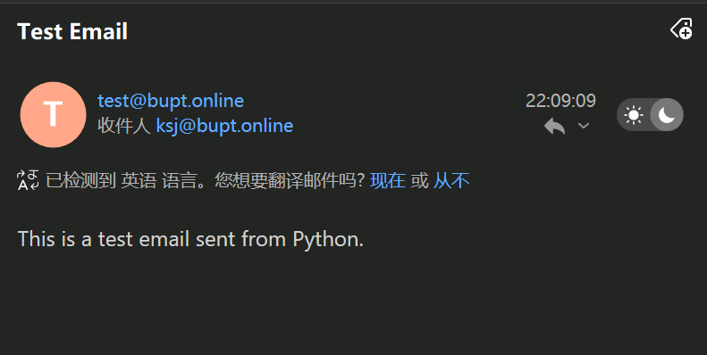

参见:

- https://docker-mailserver.github.io/docker-mailserver/latest/
- https://blog.csdn.net/qq_25866579/article/details/140717115
- https://zhuanlan.zhihu.com/p/609639797

值得注意的是docker-mailserver 并不支持通过ui注册/修改等操作， 当可以自行实现（后端通过shell命令即可

## 使用python 发送示例
```py
import smtplib
from email.mime.text import MIMEText
from email.mime.multipart import MIMEMultipart
from email.utils import formatdate

# Email configuration
smtp_server = 'mail.bupt.online'
smtp_port = 587
username = 'test@bupt.online'
password = '12345678'
from_email = 'test@bupt.online'
to_email = 'ksj@bupt.online'
subject = 'Test Email'
body = 'This is a test email sent from Python.'

# Create the email
msg = MIMEMultipart()
msg['From'] = from_email
msg['To'] = to_email
msg['Subject'] = subject
msg['Date'] = formatdate(localtime=True)
msg.attach(MIMEText(body, 'plain'))

# Send the email
try:
  server = smtplib.SMTP(smtp_server, smtp_port)
  server.starttls()
  server.login(username, password)
  server.sendmail(from_email, to_email, msg.as_string())
  server.quit()
  print("Email sent successfully")
except Exception as e:
  print(f"Failed to send email: {e}")
```

