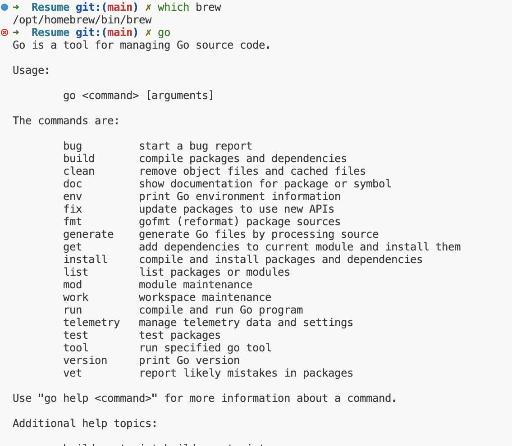

# 解决vs code中github copilot打开的终端环境变量问题

现象: 安装了 brew、cmake、jenv 等工具后，发现 github copilot 打开的终端无法识别这些命令

## 解决办法
添加如下配置到 settings.json 中:

```json
{
  // Garantir que o terminal integrado herde /opt/homebrew/bin antes do PATH atual
  "terminal.integrated.env.osx": {
    "PATH": "/opt/homebrew/bin:${env:PATH}"
  },

  // Preferir zsh como perfil e iniciar como login shell para carregar arquivos de login
  "terminal.integrated.defaultProfile.osx": "zsh",
  "terminal.integrated.profiles.osx": {
    "zsh": {
      "path": "/bin/zsh",
      "args": ["-l"]
    }
  },

  // Mantém compatibilidade com configurações antigas
  "terminal.integrated.shellArgs.osx": ["-l"]
}

```
## 效果
