# markdown-folding
笔者在使用vscode 编写md时，发现子标题 or 代码块过长，但无法折叠，又在agicy的~~教唆~~下，于是决定在假期后开发此插件。
## Create Project
TS yyds, 这里创建项目后选择第一个，
不知道怎么创建的看[这里](https://code.visualstudio.com/api/get-started/your-first-extension)。
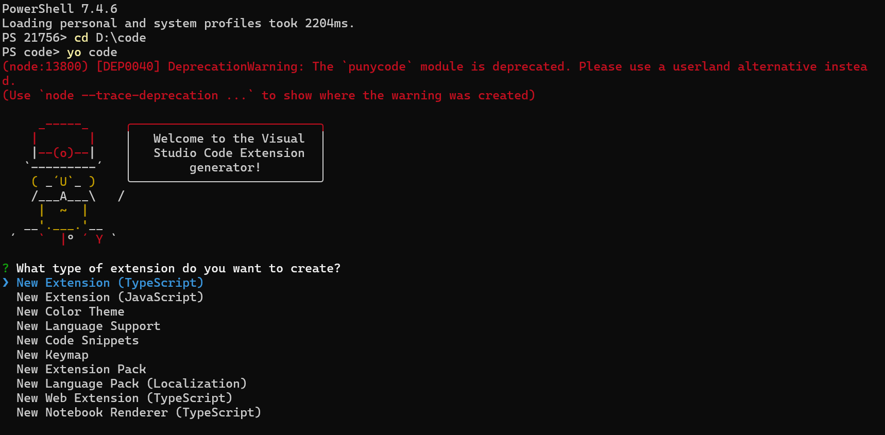
~~忽略警告~~

名字就叫```markdown-folding```

其余内容参考以下:
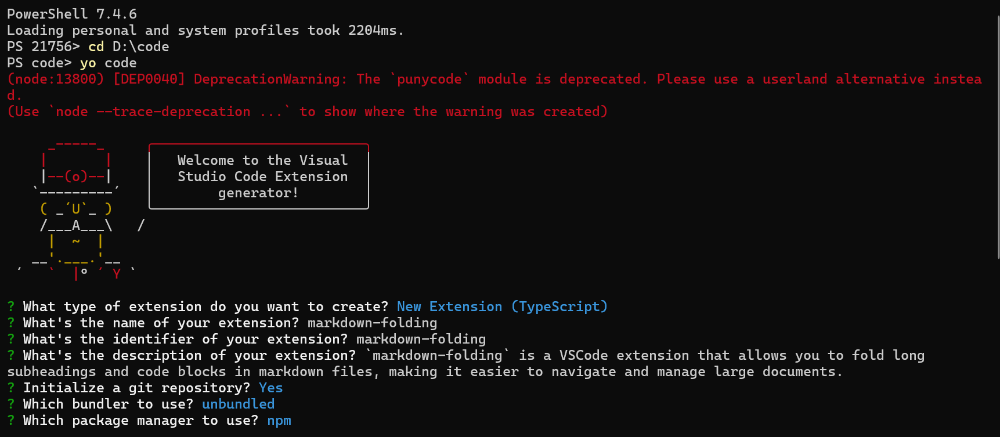

使用vscode(or vscode insider)打开项目

安装依赖
```
npm i
```

启动项目(打开```extension.ts``` 并按下```F5```)

按下```ctrl+shift+P```,并输入```Hello World```即可执行demo
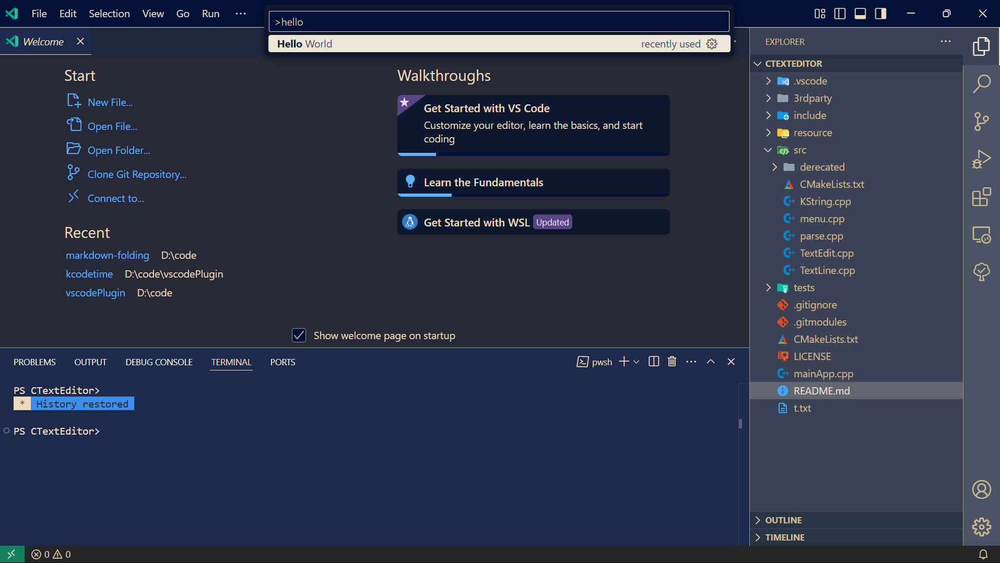
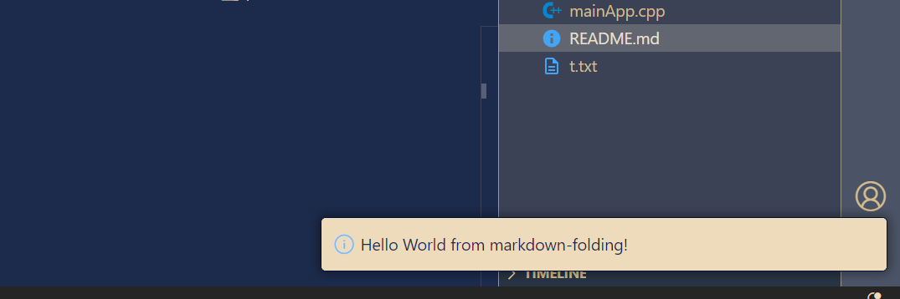
## 实现
[源码](https://github.com/King-sj/markdown-folding)

查阅资料后， 使用vscode api ```vscode.languages.registerFoldingRangeProvider```即可完成任务

最终效果如下

- 无插件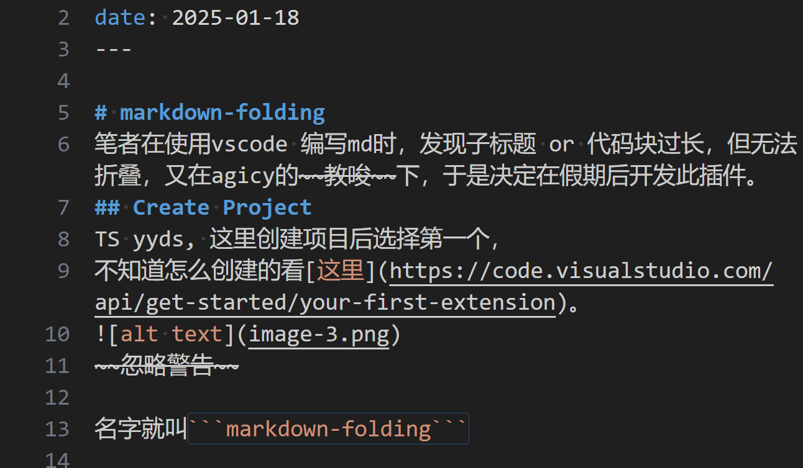
- 有插件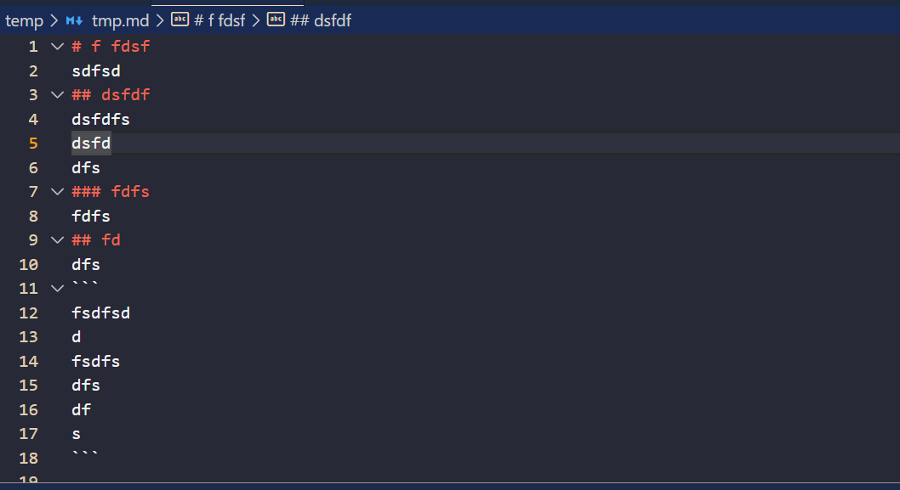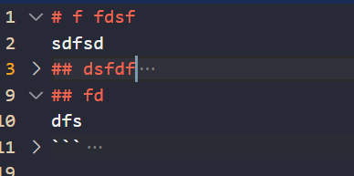

(还挺简单的~~)

## 发布
可以选择本地打包，也可以发布到应用市场，这里选择后者。

想要安装vsce
```
npm i vsce -g
```
打包成vsix文件 (提示没修改README文件是因为README.md中含有字符```README```)
```
vsce package
```

创建发布者
```
vsce create-publisher your-publisher-name
```
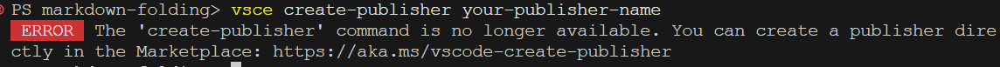
提示直接登录 https://aka.ms/vscode-create-publisher
修改```package.json```
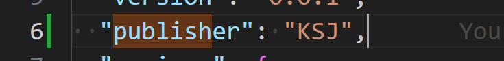
重新打包，并上传
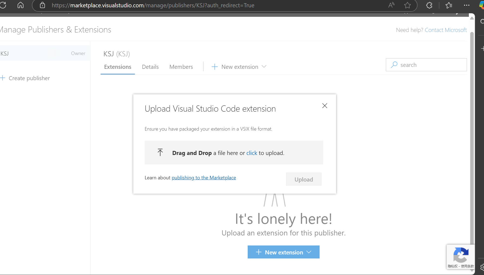
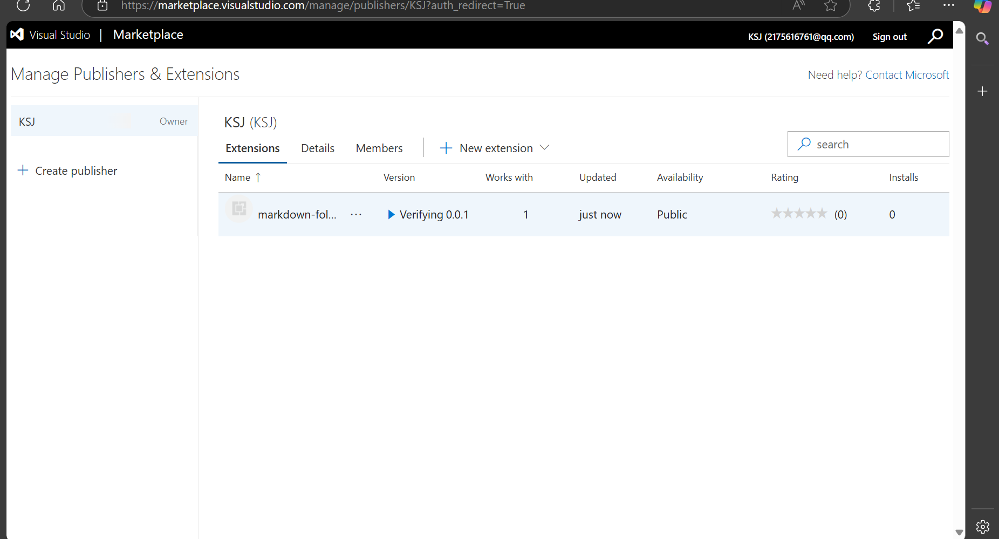
收到邮件后就成功了
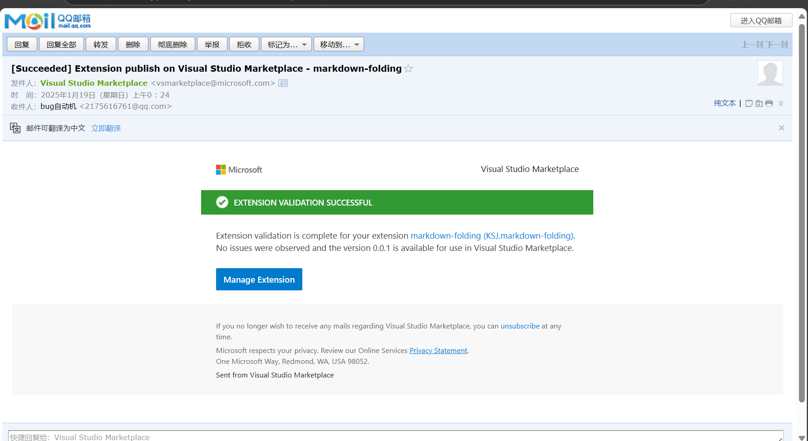
## 使用
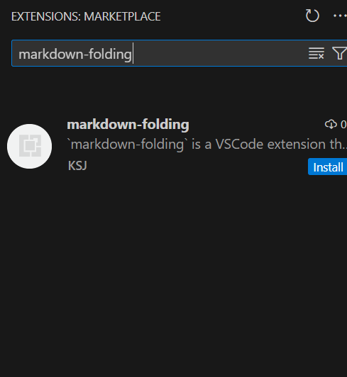
效果如下
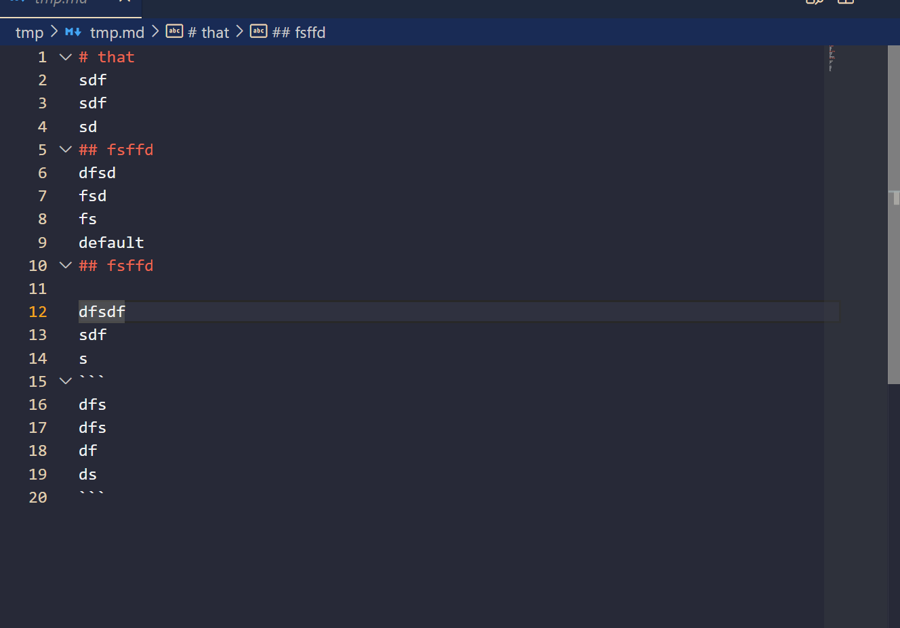

## 管理

https://marketplace.visualstudio.com/


到此结束

## 参考资料
- [VSCode插件开发全攻略](https://www.cnblogs.com/liuxianan/p/vscode-plugin-overview.html)
