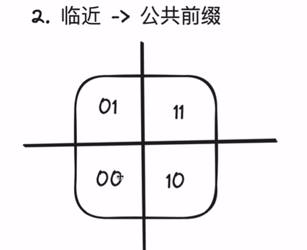
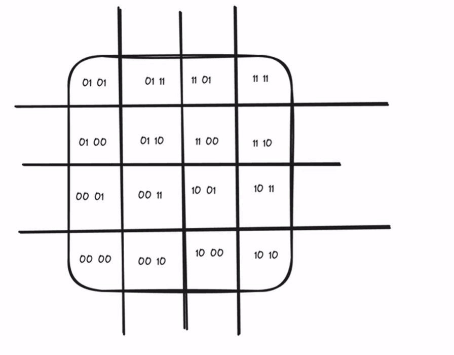
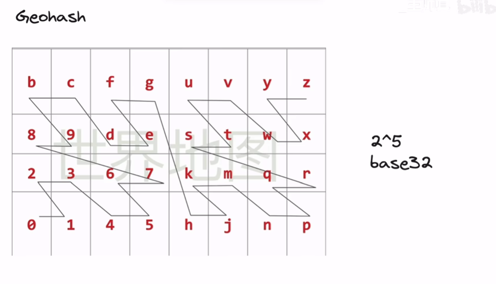

# GeoHash

【场景题：美团/饿了么“找出附近1km的商家”（下）】https://www.bilibili.com/video/BV1vz421a7UM?vd_source=2986f208574902129887e685377d2d3a

这样相邻区域

## 补充

对于要求更高的（附加最近k个商家、碰撞判断）可用quadTree（四叉树）

https://zhuanlan.zhihu.com/p/415126612
