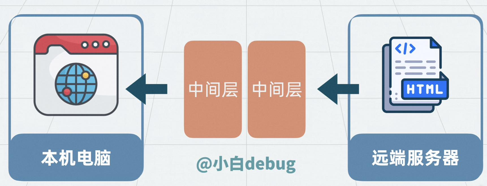
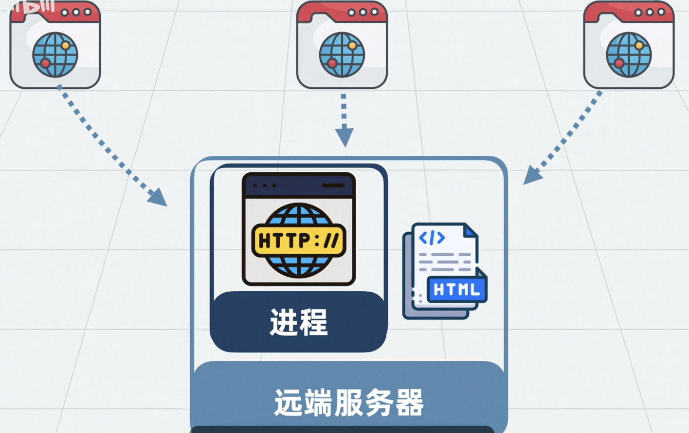
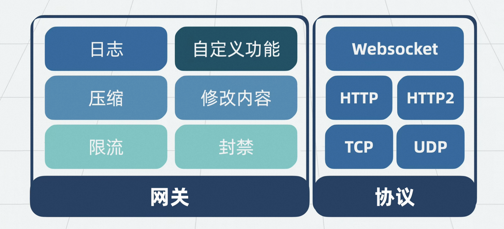
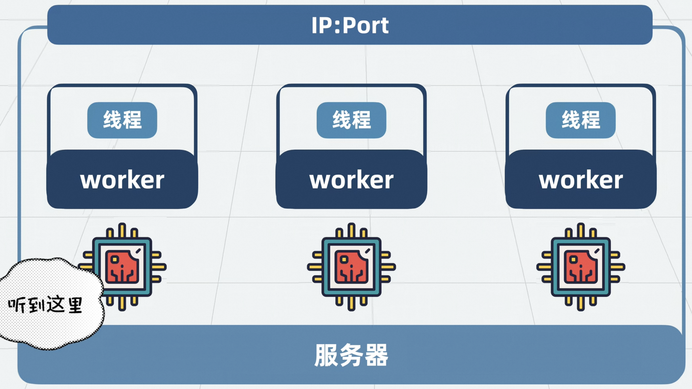
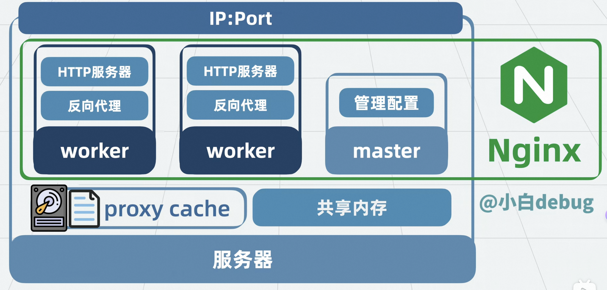

# Nginx 架构设计

Nginx 是什么？Nginx 是一个高性能的 HTTP 和反向代理服务器，也是一个 IMAP/POP3/SMTP 代理服务器。它以高并发、高可靠、低内存消耗著称，被广泛应用于网站架构中。

## 本地浏览器如何获取远端服务器上的 HTML 文件？

当你在浏览器输入网址并回车时，浏览器会向远端服务器发起 HTTP 请求，服务器返回 HTML 文件，浏览器解析并渲染页面。Nginx 作为中间层，能够高效地处理这些请求。

> 没有什么是加一层中间层解决不了的，如果有就再加一层。Nginx 就是这样一个强大的中间层。

## HTTP 服务器是什么？

HTTP 服务器是一个能够通过 URL 提供资源访问能力的进程。它监听特定端口，等待客户端请求，并返回相应的资源（如 HTML、图片、视频等）。

## 反向代理是什么？

反向代理服务器位于客户端和目标服务器之间，客户端只需与代理服务器通信，由代理服务器转发请求到后端服务器，并将结果返回给客户端。这样可以隐藏后端服务器，提高安全性和可扩展性。

## 模块化网关能力

Nginx 采用模块化设计，支持多种功能扩展，如负载均衡、缓存、访问控制等。通过加载不同模块，Nginx 可以灵活应对各种业务需求。

## 配置能力

Nginx 的配置文件（nginx.conf）极为灵活，支持多级嵌套、变量、条件判断等，便于实现复杂的流量调度和安全策略。

## 单线程、多进程架构

Nginx 采用单线程多进程模型。每个 worker 进程都是单线程，master 进程负责管理 worker。这样设计的原因：
- 避免多线程带来的锁竞争，提高稳定性。
- 充分利用多核 CPU。
- 一个 worker 崩溃不会影响其他 worker，提高可靠性。

### 多个进程监听同一个端口不会冲突的原因

操作系统（如 Linux）支持 SO_REUSEPORT 机制，允许多个进程绑定同一端口，内核会将新连接分配给不同进程，实现负载均衡。

## 内存共享

Nginx 通过共享内存区实现 worker 进程间的数据共享，如缓存、会话等，提升性能和一致性。

## Proxy Cache

Nginx 支持高效的代理缓存，能将后端响应缓存到本地，极大提升静态资源访问速度，减轻后端压力。

## Master 进程与滚动升级

Master 进程负责管理 worker，支持平滑重载配置和滚动升级，无需中断服务即可更新。

## 设计与架构图

## QA 常见问题

- **nginx是什么？架构是怎么样的？**
  Nginx 是高性能的 Web 服务器和反向代理服务器，采用单线程多进程架构，支持模块化扩展。
- **http服务器是什么？**
  提供通过 URL 获取资源能力的进程。
- **反向代理是什么？**
  代理客户端请求，隐藏后端服务器，提升安全性和可扩展性。
- **worker是什么？**
  负责实际处理请求的进程。
- **负载均衡是什么？**
  将请求分发到多台后端服务器，提升系统吞吐量和可用性。
- **nginx.conf是什么？**
  Nginx 的主配置文件。
- **master是什么？**
  负责管理 worker 的主进程。
- **共享内存是什么？**
  用于 worker 进程间数据共享的内存区域。
- **proxy cache是什么？**
  代理缓存，提高资源访问速度。
- **滚动升级是什么？网关是什么？**
  滚动升级指不中断服务的平滑升级，网关是流量入口和控制中心。
- **单线程多进程架构是什么？**
  每个进程单线程，多个进程并发处理请求。
- **怎么解决Nginx单点问题？**
  通过多实例部署+负载均衡，消除单点故障。

### 多个worker监听同一个端口，为什么不冲突?

- [两个进程能监听同一个端口吗？ - 知乎](https://zhuanlan.zhihu.com/p/612436510)
- [Linux epoll完全图解，彻底搞懂epoll机制 - 知乎](https://zhuanlan.zhihu.com/p/17856755436)

### Nginx单点问题

- [Nginx单点问题分析 - CSDN](https://blog.csdn.net/liaofeifeifeifei/article/details/124923137)

## 正向代理与反向代理对比

| 特性         | 正向代理                         | 反向代理                         |
|--------------|----------------------------------|----------------------------------|
| 代理对象     | 客户端（用户）                   | 服务器（服务端）                 |
| 典型场景     | 科学上网、访问被屏蔽网站         | 网站负载均衡、隐藏后端服务器     |
| 客户端感知   | 需要配置代理，感知代理存在       | 客户端无感知，访问的就是代理地址 |
| 主要作用     | 代理客户端访问外部资源           | 代理外部访问内部服务器           |
| 安全性       | 隐藏客户端真实身份               | 隐藏服务器真实结构               |
| 例子         | Shadowsocks、VPN                 | Nginx、Apache HTTPD              |

**简要说明：**
- 正向代理：客户端知道要访问哪个目标，但不能直接访问，需要通过代理服务器转发请求。
- 反向代理：客户端只知道代理服务器地址，代理服务器根据请求转发到后端真实服务器。

---

## 附录

- [Nginx是什么？Nginx高并发架构拆解指南-哔哩哔哩](https://b23.tv/5TP2kfG)