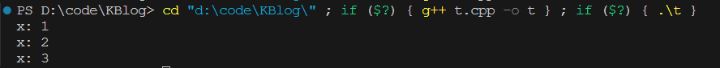

# 闭包实现类

你是否曾经想过，不用类也能封装数据和方法？这篇文章将带你走进闭包的奇妙世界，展示如何用闭包来实现这一点。通过一个有趣的代码示例，你将看到闭包是如何捕获变量并提供类似类的功能的。准备好了吗？让我们开始这段有趣的旅程吧！

<!-- more -->
::: code-tabs#cpp
@tab cpp
```cpp
#include <iostream>
#include <string>

using namespace std;

// 通过闭包实现类似类的结构
auto fun(int x) {
  int* _x = new int(x);
  // toString 函数捕获_x，用以输出当前_x的值
  auto toString = [_x]() -> string { return "x: " + to_string(*_x); };
  // add 函数用于增加_x的值
  auto add = [_x]() { (*_x)++; };
  // remove 函数用于释放_x指向的内存
  auto remove = [_x]() { delete _x; };

  // 结构体内包含三个函数
  struct {
    decltype(toString) toString;
    decltype(add) add;
    decltype(remove) remove;
  } self{toString, add, remove};

  return self;
}

int main() {
  auto obj1 = fun(1);
  auto obj2 = fun(3);
  cout << obj1.toString() << endl;  // 输出 "x: 1"
  obj1.add();                       // 增加obj1的内部_x的值
  cout << obj1.toString() << endl;  // 输出 "x: 2"
  cout << obj2.toString() << endl;  // 输出 "x: 3"
  obj1.remove();                    // 释放obj1的内部_x的内存
  obj2.remove();                    // 释放obj2的内部_x的内存
  return 0;
}
```
@tab python
```py
# TODO
```
:::


