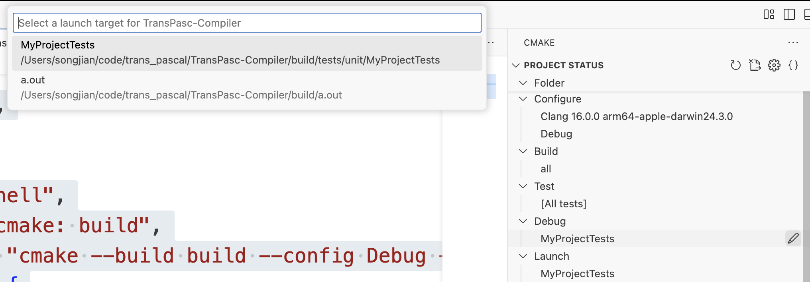
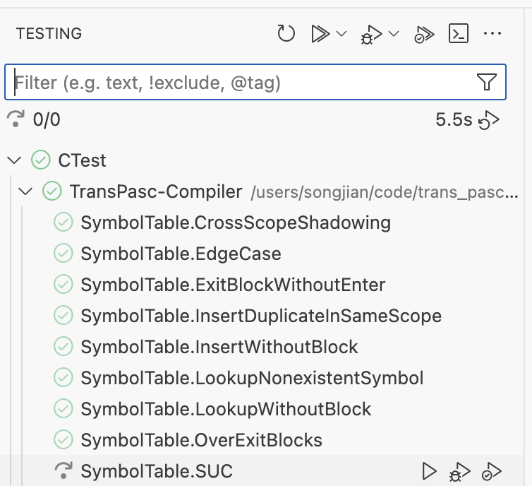

# 如何在 VSCode 中调试 Google Test

本文介绍如何在 VSCode 下配置 Google Test 的断点调试环境，包括 launch.json 和 tasks.json 的标准写法，以及调试流程说明。

## 1. 配置 launch.json

在 `.vscode/launch.json` 中添加如下内容：

```json
{
    "version": "0.2.0",
    "configurations": [
        {
            "name": "Debug GTest (Auto)",
            "type": "cppdbg",
            "request": "launch",
            "program": "${command:cmake.launchTargetPath}",
            "args": [],
            "stopAtEntry": false,
            "cwd": "${workspaceFolder}",
            "environment": [],
            "externalConsole": false,
            "MIMode": "lldb",
            "preLaunchTask": "cmake: build"
        }
    ]
}
```

## 2. 配置 tasks.json

在 `.vscode/tasks.json` 中添加：

```json
{
    "version": "2.0.0",
    "tasks": [
        {
            "type": "shell",
            "label": "cmake: build",
            "command": "cmake --build build --config Debug --target all -j 14",
            "options": {
                "cwd": "${workspaceFolder}"
            },
            "group": {
                "kind": "build",
                "isDefault": true
            }
        }
    ]
}
```

## 3. 调试流程

1. 在 CMake 的 Debug target 选择对应的测试用例（如 Test）。
2. 在测试代码中需要调试的位置打断点。
3. 在 Testing 面板中选择对应的用例，点击 Debug 按钮即可。





---

> 如遇到断点无法命中、调试信息缺失等问题，请确认 CMake 构建类型为 Debug，且编译参数包含 `-g`。