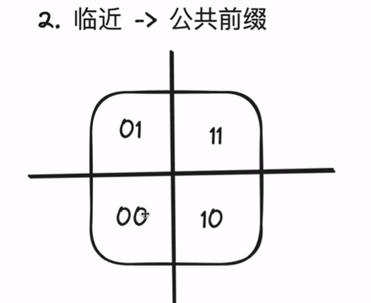
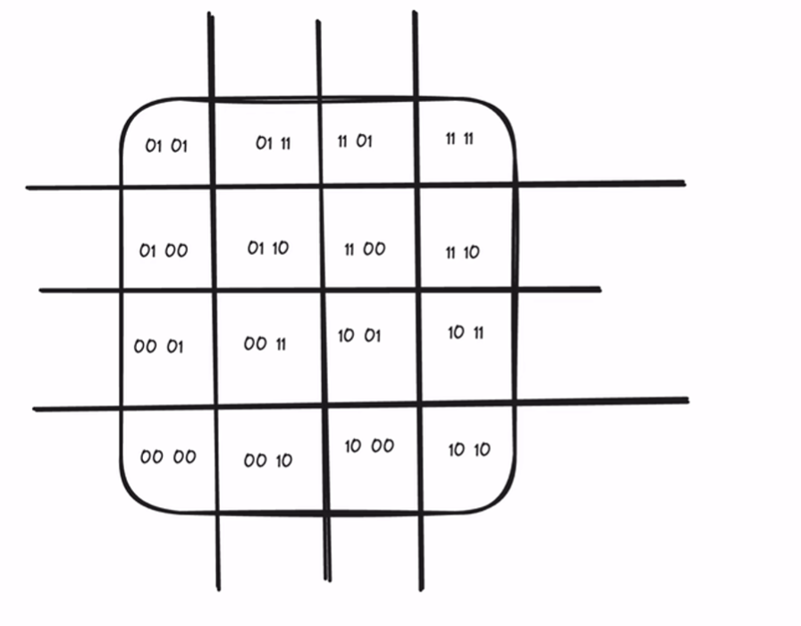
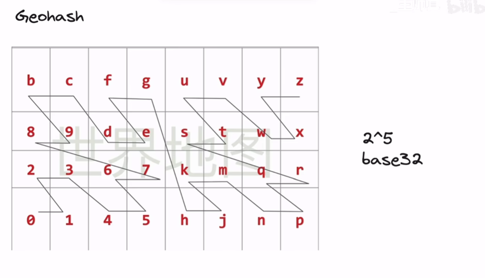

# GeoHash

GeoHash 是一种将二维地理坐标编码为一维字符串的方法，常用于附近位置搜索。

参考视频：[找出附近 1km 的商家（下）](https://www.bilibili.com/video/BV1vz421a7UM?vd_source=2986f208574902129887e685377d2d3a)

相邻区域的 GeoHash 编码具有共同前缀：

## 补充

对于要求更高的（附加最近k个商家、碰撞判断）可用quadTree（四叉树）

https://zhuanlan.zhihu.com/p/415126612
