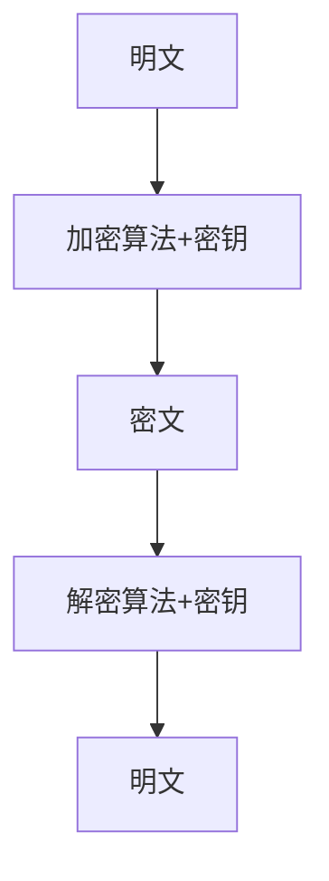
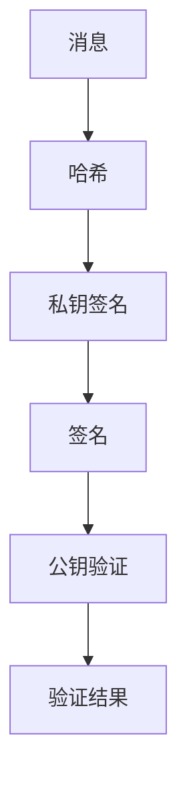

# 密码学

## 加密

加密是将明文信息通过算法和密钥转换为密文的过程，只有拥有正确密钥的人才能解密恢复原文。

### 对称加密
- 加密和解密使用同一个密钥。
- 常见算法：AES、DES。
- 优点：速度快，适合大数据量。
- 缺点：密钥分发困难。

### 非对称加密
- 使用一对密钥：公钥加密，私钥解密。
- 常见算法：RSA、ECC。
- 优点：密钥分发简单，适合安全通信。
- 缺点：速度慢，常用于加密小数据或密钥。

## 签名

数字签名用于验证消息的完整性和发送者身份。

- 发送方用私钥对消息摘要签名，接收方用公钥验证。
- 常见算法：RSA签名、ECDSA。
- 能防止消息被篡改和伪造。

## 区别

|           | 加密                 | 签名                 |
|-----------|----------------------|----------------------|
| 目的      | 保密                 | 认证、完整性         |
| 密钥      | 对称/非对称          | 非对称               |
| 过程      | 明文→密文→明文       | 明文→签名→验证       |
| 保护对象  | 信息内容             | 信息来源与完整性     |

## C++ 示例

### 对称加密（凯撒加密 Caesar Cipher）
```cpp
#include <iostream>
#include <string>
// 简单的凯撒加密实现
std::string caesar_encrypt(const std::string& plaintext, int key) {
    std::string ciphertext = plaintext;
    for (char& c : ciphertext) {
        if (isalpha(c)) {
            char base = islower(c) ? 'a' : 'A';
            c = (c - base + key) % 26 + base;
        }
    }
    return ciphertext;
}
std::string caesar_decrypt(const std::string& ciphertext, int key) {
    return caesar_encrypt(ciphertext, 26 - key % 26);
}
int main() {
    std::string text = "HelloWorld";
    int key = 3;
    std::string enc = caesar_encrypt(text, key);
    std::string dec = caesar_decrypt(enc, key);
    std::cout << "原文: " << text << std::endl;
    std::cout << "加密: " << enc << std::endl;
    std::cout << "解密: " << dec << std::endl;
    return 0;
}
```

### 签名（简单哈希+校验，非真实数字签名，仅演示原理）
```cpp
#include <iostream>
#include <string>
// 简单哈希函数
unsigned int simple_hash(const std::string& msg) {
    unsigned int hash = 0;
    for (char c : msg) hash = hash * 101 + c;
    return hash;
}
// "签名"：用私钥（这里用一个数字）和哈希值相乘
unsigned int sign(const std::string& msg, unsigned int prikey) {
    return simple_hash(msg) * prikey;
}
// "验证"：用公钥（私钥的倒数）还原哈希值
bool verify(const std::string& msg, unsigned int signature, unsigned int pubkey) {
    return simple_hash(msg) == signature * pubkey;
}
int main() {
    std::string msg = "HelloWorld";
    unsigned int prikey = 17; // 私钥
    unsigned int pubkey = 1/17.0; // 公钥（私钥的倒数，演示用）
    unsigned int signature = sign(msg, prikey);
    std::cout << "消息: " << msg << std::endl;
    std::cout << "签名: " << signature << std::endl;
    std::cout << "验证: " << (verify(msg, signature, pubkey) ? "成功" : "失败") << std::endl;
    return 0;
}
```

## 流程图

### 加密流程


### 签名流程

